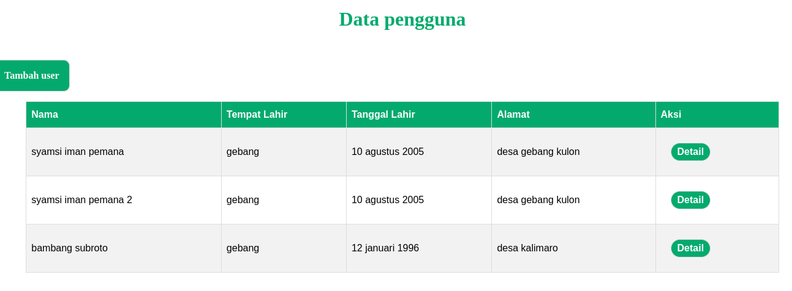
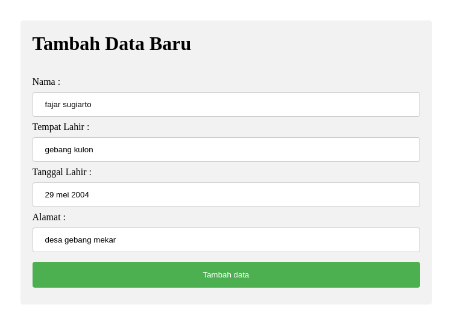

# Dahsboard pengelolahan user

project ini merupakan tugas dari program [PESILAT](https://pesilat.alkademi.id/), project ini di buat menggunakan express js
fungsi dari app ini hanya untuk menyimpan biodata user di file tanpa __Database__

## Design project - Dashboard

## Design project - Form tambah data

## cara menjalankan project

+ buka folder di terminal lalu jalankan `npm install`

+ kemudian ketikan perintah `node app.js` untuk menjalankan server

+ lalu buka `http://localhost:3000/` di browser, dan selamat mencoba

